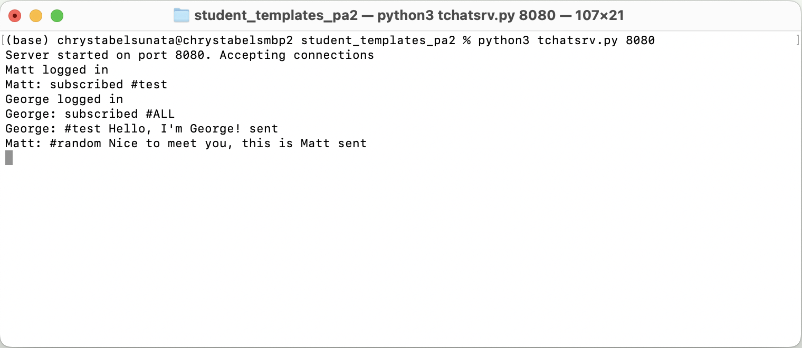
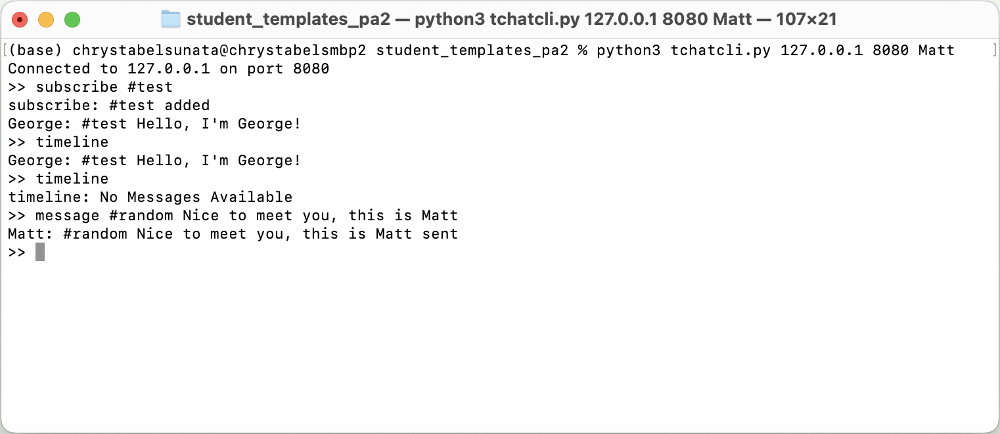
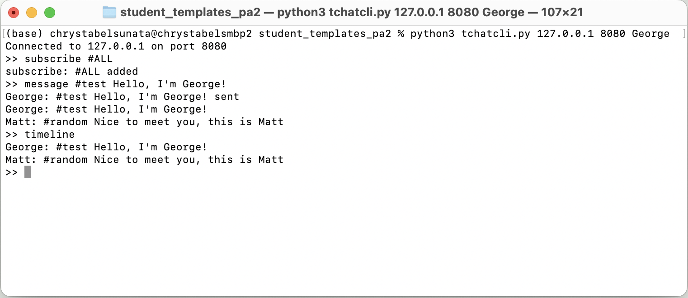

## TCP Client-Server Chatroom
This project is my implementation of a **TCP chatroom** using **Python socket programming** for CS 3251 - Computer Networking (Fall 2024) at Georgia Tech. TCP (Transmission Control Protocol) is a communication protocol that ensures the reliable transmission of data between devices on a network. 

## Overview
The chatroom follows a **client-server archictecture**. The server implementation is in `tchatsrv.py`. It handles multiple concurrent client connections, and routes messages between clients. The client implementation is in `tchatcli.py`. Clients connect to the server and handle user commands until the user exits. They can subscribe to a hashtag and send and receive messages to those hashtags. The client supports the following user commands:

`subscribe <hashtag>`: Subscribes to messages with specified hashtag
- A client can subscribe to **at most five hashtags**
- Special hashtag **#ALL** subscribes the client to all hashtags
- A client may subscribe to a non-existing hashtag
- If a client subscribes to #ALL and a specific hashtag, there will be **no duplication of messages**.

`message <hashtag> <message>`: Send messages to subscribed clients
- Valid messages are **at least 1 character and at most 150 characters**

`unsubscribe <hashtag>`: Removes subscription with specified hashtag

`timeline`: Displays all received messages since the last timeline check

`exit`: Terminates the client session

## Startup and Connection Establishment
Server: `python3 tchatsrv.py <port>`

Output (Server): `Server started on port <port>. Accepting connections`

Client: `python3 tchatcli.py <serverIP> <serverPort> <username>`

Output (Client): `<username> logged in`

Output (Client): `Connected to <hostname> on port <port>`

If the username is taken: 

Output (Client): `Connection Failed: Username Taken`

## Usage Example
### Server Running
Once the server is started, it listens for incoming client connections. The server logs whenever a user logs in and subscribes.

### Client 1 (Matt) Connected
In this example, Matt subscribes to #test and receives a message from Client 2 (George) when George sends a message to #test. The `timeline` command displays all received messages since the last `timeline` command.

### Client 2 (George) Connected
George subscribes to #ALL, which allows him to receive all messages sent by any client, including his own and those sent by Client 1 (Matt)

